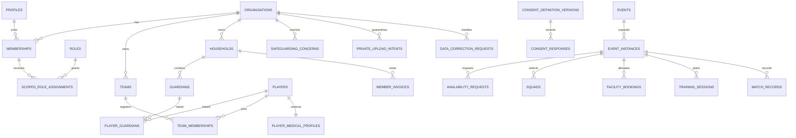

# Entity relationship overview

The diagram is intentionally conceptual. Migrations define the complete columns, checks, RLS policies and composite tenant foreign keys. Children are player records, not authenticated profiles.
